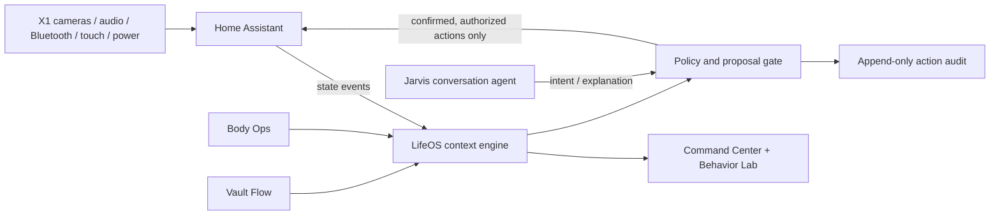

# Jarvis Hub

Self-hosted smart home hub for a ThinkPad X1 (Gen 3) — better than Alexa/Google Home:
fully local, private, conversational (LLM-powered), and infinitely automatable.

Controls the currently commissioned Home Assistant lights and expands safely as
media, cleaning, climate, and security hardware is added later.

Full long-form plan: [docs/PLAN.md](docs/PLAN.md)

Sanctuary OS v1.2 is the governed apartment experience layered over Jarvis:
Home Assistant owns local device execution, LifeOS owns context and audit, and
Google Home is an optional bridge. The versioned master manual and the
[commissioning runbook](docs/SANCTUARY-COMMISSIONING.md) define the approved
room identities, calibration gate, routines, and rollout.

## Quick start (on the X1, fresh Ubuntu Server 24.04)

```bash
sudo apt update && sudo apt install -y git
git clone https://github.com/GiovanniBiscottiofficial/Jarvis-Hub.git
cd Jarvis-Hub
bash bootstrap/setup-x1.sh
```

Then open `http://<laptop-ip>:8123`, create your account, and follow the phases below.

## Build status — where we are

**Software foundation: implemented and continuously tested.** The repository now
contains the orchestration, LifeOS, voice, kiosk, safety policy, simulations, and
automation layers. Real-world readiness still depends on commissioning each device
and calibrating each room on the X1. Missing hardware stays visibly
`not_commissioned`; it is never represented by a service-calling placeholder. Use
**[docs/CONNECT-DEVICES.md](docs/CONNECT-DEVICES.md)** as the commissioning runbook.

**Built and in this repo:**
- Core stack: Home Assistant + LifeOS + optional profiles (voice, LLM, Grocy, cameras, Plex, Jellyfin)
- LifeOS: briefings, protein/water/steps, meals & favorites, pantry/grocery, workouts,
  weigh-ins, spending, bills, accounts, savings goals, weekly review, PWA install
- Voice: ~60 sentence intents (ask/log/control), timers, reminders, context memory,
  wisdom & sarcasm, diagnostics, announcements
- Dashboard: Wall kiosk view, boot splash, holographic Jarvis avatar orb, Twin tab,
  Media quick-launch tiles, dark-glass Jarvis theme, on-screen keyboard
- Sanctuary Spatial Command Center: interactive apartment blueprint, canonical
  room identities, room drawers, live light/readiness state, Manual Hold, and
  calibration controls for the X1 and phone
- Proactive layer: 6:30 workday wake-up, schedule-aware dinner nudge, medication +
  hydration, circadian lighting, welcome home, nightly musing, power-outage alerts,
  safe shutdown, charge cap, CPU temp watch, nightly backups
- Jarvis knows Giovanni: **Mon–Fri 8–5** at the office (out the door by 7:35, nudge at
  7:30), vitamins reminder at 7:00, evening-workout habit nudge at 6:30 PM, payday
  heads-up (13th + 2 days before month-end), R&B/lo-fi music taste, Food Lion, the
  Lexus, NBA/WNBA — all in `docs/jarvis-personality.txt` (for the LLM) and wired into
  the proactive automations
- Scaffolded, waiting on hardware/integrations (each file says what to plug in):
  thermostat/GPS/Waze arrival, calendar meeting prep, doorbell, gaming mode, emergency
  sensors, security cameras/faces, air quality, energy pricing, sleep recap

**Your to-do when you're back at the X1 (in order):**
1. `cd ~/Jarvis-Hub && git pull && bash bootstrap/setup-x1.sh && docker compose up -d --build lifeos && docker restart homeassistant`
2. Finish the voice pipeline if not done: Phase 3 below (Whisper/Piper/openWakeWord + "hey Jarvis")
3. One-time remote access: `bash bootstrap/setup-remote-access.sh` (sign in via the printed link, then install the Tailscale app on your phone)
4. The LLM brain (Phase 8) — this is the "spark": `docker compose --profile llm up -d`, pull llama3.2:3b, set it as the Assist conversation agent, paste in [docs/jarvis-personality.txt](docs/jarvis-personality.txt)
5. Pair real devices as you get them (lights, vacuum, Fire TV — Phase 2/16) and swap the placeholder entity IDs
6. Plex first start (the claim token expires in 4 minutes, so do this in one sitting):

   ```bash
   cd ~/Jarvis-Hub
   mkdir -p ~/jarvis-media/{movies,tv,music}
   # get a FRESH token at https://plex.tv/claim, then within 4 minutes:
   echo "PLEX_CLAIM=claim-XXXX" >> .env
   docker compose --profile media up -d
   ```

   Finish setup at `http://<laptop-ip>:32400/web`, then HA → Add Integration → **Plex**.
   The token is only needed the very first start — after that Plex stays claimed.
7. Set the LifeOS secrets in `.env` (use long random values; do not commit `.env`):

   ```bash
   openssl rand -hex 32
   # Set LIFEOS_API_TOKEN to one random value and LIFEOS_HEALTH_WEBHOOK_SECRET to another.
   # For Health Auto Export, add these REST API headers:
   # Authorization: Bearer <LIFEOS_API_TOKEN>
   # X-LifeOS-Webhook-Secret: <LIFEOS_HEALTH_WEBHOOK_SECRET>
   # Its built-in session-id header is used as the duplicate-event key.
   ```

9. Optional meal-photo vision analysis (local-only):

   ```bash
   docker compose --profile llm up -d
   docker exec -it ollama ollama pull gemma3:4b
   docker compose up -d --build lifeos
   ```

   LifeOS sends plate photos to the local Ollama vision model and shows an editable
   estimate. Nothing is added to the meal log until you review and confirm the macros.

10. Weather in the morning briefing — home coordinates into `.env`:

   ```bash
   cd ~/Jarvis-Hub
   echo "LIFEOS_LAT=36.334154" >> .env
   echo "LIFEOS_LON=-79.660757" >> .env
   docker compose up -d lifeos
   ```

**Every optional `docker compose` profile (run the ones you want, in any order):**

```bash
docker compose --profile voice up -d      # Whisper + Piper + openWakeWord ("hey Jarvis") — Phase 3
docker compose --profile llm up -d        # Ollama — the LLM brain (then: docker exec -it ollama ollama pull llama3.2:3b)
docker compose --profile grocy up -d      # Grocy pantry/barcode tracking — Phase 15
docker compose --profile cameras up -d    # Frigate + go2rtc (after adding camera URLs to frigate/config.yml)
docker compose --profile media up -d      # Plex (needs PLEX_CLAIM in .env + files in ~/jarvis-media)
docker compose --profile jellyfin up -d   # Jellyfin — free alternative to Plex
docker compose --profile voice --profile llm --profile grocy up -d   # or stack profiles in one command
```

The core stack (Home Assistant + LifeOS) needs no profile — `docker compose up -d` (or `setup-x1.sh`) starts it.

## What's in this repo

| Path | What it is |
|---|---|
| `docker-compose.yml` | The whole stack: Home Assistant + optional voice / Grocy / LLM profiles |
| `bootstrap/setup-x1.sh` | One-time laptop prep (lid-close, no-sleep, Docker) + starts the stack |
| `bootstrap/setup-kiosk.sh` | Turns the X1's screen into a Google-Home-style hub display (boots into the Jarvis dashboard fullscreen) |
| `bootstrap/setup-remote-access.sh` | Tailscale tunnel — control everything from work/cellular, nothing exposed to the internet |
| `bootstrap/setup-backups.sh` | Nightly 3 AM backup of the LifeOS DB + HA config (`backup.sh` runs one on demand; point `BACKUP_DIR` at a USB drive) |
| `bootstrap/setup-satellite.sh` | Turns the X1's own mic into a "hey Jarvis" satellite and its webcam into an RTSP camera for Frigate/HA |
| `bootstrap/setup-gestures.sh` | Hand-gesture control: swipe at the webcam to scroll Shorts, skip videos, or go back (MediaPipe + local Chromium DevTools) |
| `ha-config/configuration.yaml` | Home Assistant base config (loads the automations/scripts below) |
| `ha-config/automations/` | Starter automations: movie mode, presence, vacuum-stuck alert, shopping reminder |
| `ha-config/scripts/` | Voice-callable scenes: "movie night", "goodnight" |
| `ha-config/dashboards/jarvis.yaml` | "Jarvis" command-center dashboard (Home / Vacuum / Media / Kitchen / System tabs) |
| `lifeos/` | Jarvis's operating layer: Command Center + context engine + Budget & Vault + Body Ops, on port 8090 |
| `docs/PLAN.md` | The full build plan |

## Jarvis context engine and Command Center

LifeOS is Jarvis's operating layer, not a separate tracker. It maintains a durable,
explainable world model and fuses it with personal state: daily health progress,
near-term financial runway, priorities, X1 hardware readiness, proposals, and the
Home Assistant event stream. Open LifeOS and select **Command** for the complete
operating picture.

Home Assistant forwards meaningful `state_changed` events through
`ha-config/automations/context_engine.yaml`. LifeOS evaluates three behaviors:

- arrival orchestration when a known person comes home;
- departure anomaly detection when the last person leaves with an open entry;
- a nightly perimeter and alarm review at 10:45 PM.

Behaviors create proposals; they do not silently operate locks, doors, or alarms.
The Behavior Lab exercises arrival, departure, and nightly scenarios without
writing house state or controlling devices. The Command Center's action controls
remain dry-run simulations. Direct live calls to
`POST /api/actions/{action_id}` require the policy's confirmation flag and a
Home Assistant long-lived token. To enable that API intentionally, add these to
`.env` and rebuild LifeOS:

```bash
HOME_ASSISTANT_URL=http://host.docker.internal:8123
HOME_ASSISTANT_TOKEN=replace-with-a-long-lived-access-token
```

Leave the token unset to keep all action execution in dry-run mode. Critical
actions such as closing the garage are local-confirmation-only even with a token.

Context APIs:

- `GET /api/command-center` — fused house, LifeOS, policy, capability, and proposal view;
- `GET /api/context` — current derived world state;
- `GET|POST /api/events` — event history and ingestion;
- `GET|POST /api/proposals` — pending actions and manual behavior evaluation;
- `POST /api/proposals/{id}/dismiss` — close a proposal with an audit record;
- `POST /api/simulations/{arrival|departure|nightly}` — side-effect-free behavior lab;
- `GET /api/actions`, `GET /api/actions/audit`, and `POST /api/actions/{action_id}` —
  policies, audit history, and guarded execution.

Every action declares its scope, risk, reversibility, confirmation policy, and
whether remote execution is allowed. This is the central rule: the LLM may explain
and propose, but only the deterministic policy layer may authorize an action.

### System architecture



The split is deliberate: Home Assistant owns devices, LifeOS owns durable personal
and contextual intelligence, Jarvis owns conversation and synthesis, and the policy
gate owns authority.

## Sanctuary state machine

`input_select.sanctuary_mode` is the single apartment state. All lighting uses
Home Assistant Areas through capability-aware, light-only scripts; no Sanctuary
scene can target a switch, lock, cover, alarm, climate entity, or vacuum. The
Entry internet-power switch is explicitly protected.

Scheduled behavior ships OFF. Calibrate the room levels, exercise manual scenes,
set `input_boolean.sanctuary_calibration_ready`, and only then enable
`input_boolean.sanctuary_automations_enabled`. Manual Hold always protects user
changes. See
[docs/SANCTUARY-COMMISSIONING.md](docs/SANCTUARY-COMMISSIONING.md).

The weekday sequence begins Sunrise at 6:30 AM and stages preparation through
7:20 AM. Shower, Wind Down, Thunderstorm, and protected Sleep begin at 8:00,
9:00/9:30, 10:00, and 10:30 PM. Thunderstorm lighting stays at the calibrated
1–2% level until weekday Sunrise; media playback is independent.

Legacy routines that targeted placeholder lights, vacuums, media players, locks,
or sensors are retired. Capability-aware routines discover only available,
commissioned entities through Home Assistant Areas.

## Phase checklist

All the code for every phase is **already built and in this repo** — each checkbox is
the one-time setup action only you can do at the X1 (pairing, logins, app installs).
Tick them off as you go.

**Core — do these first (same order as the to-do list above):**

- [ ] **Phase 0–1 — Hub**: run `bootstrap/setup-x1.sh`, open HA at `:8123`, create account; then `bash bootstrap/setup-kiosk.sh` + reboot for the wall-display mode
- [ ] **Phase 3 — Voice**: `docker compose --profile voice up -d`, then HA → Add Integration → **Wyoming** three times (ports 10300 Whisper, 10200 Piper, 10400 openWakeWord); build the Assist pipeline with wake word "hey Jarvis"; `bash bootstrap/setup-satellite.sh` to make the X1's own mic listen room-wide
- [ ] **Phase 8 — The LLM brain**: `docker compose --profile llm up -d && docker exec -it ollama ollama pull llama3.2:3b`, add the **Ollama** integration (`http://<laptop-ip>:11434`), set it as the Assist conversation agent, enable "Control Home Assistant", and paste [docs/jarvis-personality.txt](docs/jarvis-personality.txt) (already loaded with Giovanni's schedule, people, tastes) into its Instructions. (Or the Anthropic/OpenAI integration for a smarter cloud agent.)
- [ ] **Remote access**: `bash bootstrap/setup-remote-access.sh` once at home — Tailscale tunnel for controlling everything from work/cellular
- [ ] **Phase 18 — LifeOS**: already up with the core stack at `http://<laptop-ip>:8090` (Today / Body Ops / Budget & Vault / Review; installable as a phone app). Your part: set the weather coordinates (step 7 above), confirm bills and pantry inventory, and optionally point the iPhone "Health Auto Export" app at `http://<laptop-ip>:8090/api/webhooks/health` for automatic Apple Watch/scale sync; configure its authentication headers to match the signed webhook contract described above. A scale works through this bridge only when its companion app writes Weight into Apple Health.
- [ ] **Backups**: `bash bootstrap/setup-backups.sh` — nightly 3 AM backup of the LifeOS DB + HA config

**Devices — pair as you go:**

- [ ] **Phase 2a — Lights**: re-pair Monster lights in the *Smart Life* app, then HA → Add Integration → **Tuya** (scan QR with Smart Life)
  - The Wall dashboard discovers enabled `light.*` entities automatically through
    `/local/jarvis-lights.html`; no dashboard YAML rename is needed after pairing.
    Lights are grouped by Area with power, brightness, and supported color controls.
- [ ] **Phase 2b — Vacuum**: try pairing the Juno in Smart Life too; if it won't, install HACS + **tuya-local**
- [ ] **Phase 5 — Presence**: install the HA Companion app on every phone; link people in Settings → People (unlocks welcome-home, arrival scaffolds, remote Assist)
- [ ] **Phase 16 — Fire TV**: enable ADB Debugging on the Fire TV, HA → Add Integration → **Android TV** with its IP; install "Notifications for Fire TV" for on-screen alerts (unlocks movie mode + quiet-mode-while-watching)
- [ ] **Phase 17 — Computers**: enable Wake-on-LAN in BIOS, add MACs to the `wake_on_lan` integration; install **HASS.Agent** on Windows machines
- [ ] **After pairing**: swap the placeholder entity IDs (`light.living_room`, `vacuum.juno`, `notify.mobile_app_phone`…) in `ha-config/` for your real ones

**Optional extras — whenever you feel like it:**

- [ ] **Phase 15 — Fridge/pantry**: `docker compose --profile grocy up -d`, open `http://<laptop-ip>:9283`, add the Grocy integration via HACS; barcode-scan with the Grocy Android app
- [ ] **Cameras (when you get them)**: put each camera's RTSP URL in `frigate/config.yml`, run `docker compose --profile cameras up -d`, add the **Frigate** integration via HACS — live views land on the dashboard's Cameras tab (viewable from work via Tailscale)
- [ ] **Plex media server**: drop movies/shows/music into `~/jarvis-media`, claim token into `.env` (step 6 above), `docker compose --profile media up -d`, then HA → Add Integration → **Plex**. "Hey Jarvis, play [movie]" works through Assist once the player entities exist; Plex-triggered movie lighting is ready to uncomment in `ha-config/automations/movie_mode.yaml`. QuickSync transcoding is wired, but with 8 GB RAM prefer direct play. Prefer no account/free? **Jellyfin**: `docker compose --profile jellyfin up -d`, set up at `http://<laptop-ip>:8096`, then HA → Add Integration → **Jellyfin** — same media folder, same transcoding
- [ ] **Spotify mood music**: add the Spotify integration (free dev app), then uncomment the R&B-evenings / lo-fi-focus automation in `ha-config/automations/entertainment.yaml`
- [ ] **Hand gestures**: `bash bootstrap/setup-gestures.sh` (after the satellite script) — swipe at the webcam to scroll Shorts (up/down), skip a video (forward), or go back (back). See "The X1 as a sensor node" below
- [ ] **NFC tags**: write a nightstand + door-frame tag with the Companion app, paste the tag IDs into `ha-config/automations/nfc_tags.yaml`
- [x] **Wall+ UI upgrade** — DONE, no HACS needed: **Bubble Card**, **Mushroom**, **mini-graph-card**, and **card-mod** are bundled in `ha-config/www/community/` and registered as dashboard resources, so the **Wall+** tab works out of the box: animated slider light buttons with pop-up room panels, status chips (room atmosphere, work hours, battery, CPU), live CPU/RAM/temp/battery graphs, the avatar, and the briefing. To make Wall+ the kiosk screen: `KIOSK_URL="http://localhost:8123/local/jarvis-splash.html?next=/jarvis-hub/wall-plus" bash bootstrap/setup-kiosk.sh` and reboot

Everything else (dashboards, cameras, Zigbee sensors, custom wake word, the whole Jarvis roadmap) is in [docs/PLAN.md](docs/PLAN.md).

## Ask Jarvis about your life

Once the voice pipeline (Phase 3) is up, these work out of the box — by voice or typed
into Assist (works remotely through the Companion app too):

Ask:
- "brief me" · "how did I do this week"
- "how much protein do I have left" · "how's my steps"
- "what bills are due this week" · "how much money do I have left"
- "what can I eat" · "what's for dinner" — pantry-matched picks plus how much
  protein you still need today
- "evening report" · "how did I do today" — the day's recap: protein, water,
  steps, workouts, vitamins, spending, and upcoming bills
- "how much have I spent this week" · "what's on the grocery list"
- "how much water have I had today" · "water check"
- "how are my savings" · "how much have I saved"
- "is the house ready for the night" · "house status" — Jarvis checks the
  lights, vacuum, and house modes and reports back

Log (Jarvis writes straight into LifeOS):
- "I took my vitamins" · "log 45 grams of protein"
- "log a weigh-in of 185" · "log 6000 steps"
- "I'm having a treat" — schedules the 15-min balance circuit automatically
- "I did my workout" · "log a workout" — completes today's planned session
  (or logs a freestyle one) so streaks stay honest
- "I spent 40 at the gas station" — discretionary spending (shows up in the
  briefing and weekly review)
- "add chicken to the grocery list" · "we're out of milk"
- "take chicken off the grocery list" · "clear the grocery list"
- "remind me to move the laundry in 30 minutes"
- "set a timer for 10 minutes" · "cancel my timers" / "cancel all my reminders"
- "log a glass of water" · "I drank 3 glasses of water" — counts toward the
  daily 8-glass target (shown on the LifeOS Today tab)
- "set my usual breakfast to sweet potato and eggs", then "log my usual
  breakfast" — one-phrase meal logging with real macros

Budget & Vault by voice:
- "log a deposit of 500 to OnePay" · "add 200 to True Lion"
- "mark rent paid" · "I paid the electric bill"
- "add a bill called internet for 80 dollars due on the 15th"
- "add an account called savings"
- "add 50 to my vacation fund" · "save 25 dollars for Christmas" — savings
  goals with progress bars on the Vault Flow tab (a new goal is created
  automatically the first time you mention it)

House control:
- "tell everyone dinner's ready" / "announce ..." — whole-house announcement
  (edit the speaker in `ha-config/scripts/announce.yaml`)
- "wake up" · "initialize all systems" — the full Jarvis awakening sequence
  (lights, greeting, status report to your phone)
- "quiet mode on" / "quiet mode off" — hold all announcements except
  emergencies (also flips on automatically while the TV is playing)
- "I'm having a bad day" · "I'm stressed" — cozy lights + a kind word
- "thank you Jarvis" — he has opinions about his own brilliance
- "remember that I park in spot 22B" · "what did I ask you to remember" ·
  "forget that" — durable context memory (stored in LifeOS, survives restarts)
- "I took my medication" — silences the morning reminder for the day
- "run a diagnostic" · "how are you feeling Jarvis" — spoken systems report
  with real CPU/memory/disk/power numbers

### Beyond the ordinary (the proactive layer)

All in `ha-config/automations/` — active immediately unless noted:

- **Proactive**: workday wake-up briefing at 6:30; out-the-door nudge at 7:30
  (leave by 7:35); evening workout nudge at 6:30 PM on weekdays; payday heads-up
  on the 13th and 2 days before month-end; dinner suggestion at 4 PM on weekends,
  5:30 PM on workdays — Jarvis knows the Mon–Fri 8–5 schedule (`proactive.yaml`,
  `binary_sensor.giovanni_work_hours` in `configuration.yaml`).
- **Contextual**: quiet mode auto-on during movies via the `Current activity`
  sensor; dim red night-path light on late-night motion once a motion sensor
  is added (`contextual.yaml`, sensor in `configuration.yaml`).
- **Personality**: random witty confirmations (`scripts/jarvis_quips.yaml`),
  the full awakening sequence (`scripts/awaken.yaml`), mood support.
- **Entertainment**: upgraded movie night (Fire TV + dimmed ambiance), lights
  fade back up after the credits; Spotify mood-music scaffold commented until
  you add the Spotify integration (`entertainment.yaml`).
- **Digital twin**: new **Twin** dashboard tab — live activity, house modes,
  power flow; drop `ha-config/www/floorplan.png` and uncomment the
  picture-elements block for a tappable floorplan.
- **Health** (`health.yaml`): 8 AM medication reminder with a "Taken" /
  "Remind in 30 min" button on your phone (resets nightly), and hydration
  nudges every 2 hours that read your real LifeOS water log — tap "Drank one"
  to log a glass without saying a word.
- **Circadian lighting** (`circadian.yaml`): flip on the *Circadian lighting*
  toggle and lights that are already on shift from energizing cool white by
  day to warm candlelight at night (never turns anything on by itself); plus
  a weekday sunrise-simulation ramp in the bedroom from 6:15, so the 6:30
  briefing doesn't start in the dark. Edit the light entities to yours.
- **Personality moments** (`personality.yaml`): a context-aware welcome-home
  greeting (needs the Companion app person entity) and a nightly 10:45 PM
  musing — both respect quiet/sleep/guest modes.
- **Location & calendar scaffolds** (`location.yaml`, all commented with
  exact instructions): pre-heat when you're 5 minutes from home (Companion
  app GPS + thermostat), heavy-traffic alerts (Waze Travel Time), 15-minute
  meeting prep with auto quiet mode (calendar integration), doorbell chime,
  and gaming mode (PS5 integration).
- **Needs hardware/integrations (safe to leave as-is until then)**:
  - Emergency response — all lights red + evacuation announce + phone alert on
    smoke/CO/leak (`emergency.yaml`; any Zigbee detector, leak sensors ~$12).
  - Security — known-face welcome, unknown-visitor snapshot with actionable
    phone notification, wave-at-camera gesture (`security.yaml`; needs
    Frigate + Double Take on the camera; auto-unlock stays commented on purpose).
  - Environment — storm prep + air-quality purifier automation
    (`environment.yaml`; needs a weather integration / PM2.5 sensor).
  - Optimization — charge-when-power-is-cheap, HVAC filter reminder
    (`optimization.yaml`; needs a price sensor / smart thermostat).
  - Kitchen — 5 PM "use it before it expires" from Grocy (`kitchen.yaml`).
  - Wellness — morning sleep recap from your phone's sleep data
    (`wellness.yaml`; Companion app sleep sensors).

Jarvis also announces new LifeOS nudges through the house speaker and your phone
(`ha-config/automations/nudges.yaml` — set your real speaker/notify entities there;
nudges stay quiet during guest mode and sleep mode).

Sentences live in `ha-config/custom_sentences/en/lifeos.yaml`, answers in
`ha-config/intents.yaml` (fed by LifeOS's `/api/ask`). Add your own phrasings any time.

## LifeOS on your phone — a real app

LifeOS is an installable PWA: open `http://<hub-ip>:8090` on your phone, then
**Add to Home Screen** (Safari share menu on iOS, Chrome menu on Android). You
get a proper Jarvis-blue app icon and a fullscreen standalone app — no browser
bars — and the app shell still opens if the hub is briefly unreachable.

## The hub display (Google-Home style)

The X1 isn't just the server — its own screen becomes the house's control panel:

```bash
bash bootstrap/setup-kiosk.sh   # then reboot
```

If the X1 opens Chromium as a small window or gets stuck on a plain white 4xx
page while Home Assistant is still running, switch to a terminal with
`Ctrl+Alt+F2` and run:

```bash
cd ~/Jarvis-Hub
git pull
bash bootstrap/repair-kiosk.sh
```

The repair checks Home Assistant, restores the stable X11/Openbox kiosk session,
forces Chromium to the X1's full display geometry, and restarts tty1. It preserves
the remembered Home Assistant login and user data and does not use a reload
watchdog.

If Home Assistant loads but Wayland leaves Chromium as a small centered box or
causes a white reload loop, run `bash bootstrap/revert-kiosk-to-x11.sh`. This
removes the Weston tty1 launch and restores the stable X11/Openbox fullscreen
session with explicit 3000×2000 bounds.

It boots into a live animated **Jarvis boot splash** (spinning arc-reactor core,
"INITIALIZING SYSTEMS…", moving circuit grid — `ha-config/www/jarvis-splash.html`,
also viewable any time at `http://<hub-ip>:8123/local/jarvis-splash.html`), which
hands over to the **Wall** view of the Jarvis dashboard — big clock, the
morning briefing, giant light/scene/vacuum tiles, the shopping list, and a "Jarvis
activity" feed of his recent actions — fullscreen,
screen always on, running on a lightweight **Wayland** compositor (Weston) with
Chromium in native Wayland mode for smooth touch and proper HiDPI,
in the dark-glass **Jarvis** theme (`ha-config/themes/jarvis.yaml`;
set it everywhere from your HA profile → Theme → Jarvis). No keyboard needed: the
X1's screen logs into HA automatically (localhost is a trusted network) and an
on-screen touch keyboard pops up whenever you tap a text box.
Prefer another page? `KIOSK_URL=http://localhost:8123/jarvis-hub/home`
(full dashboard) or `KIOSK_URL=http://localhost:8090` (LifeOS) before running the script.
(Ctrl+Alt+F2 gets you back to a terminal any time.)

## House modes & taps

- **Vacation mode** (toggle on the Home tab): occupancy theater — staggered,
  randomized evening lights so the house looks lived-in (`ha-config/automations/vacation.yaml`).
- **NFC tags** (~$0.30 stickers): tap the nightstand tag for goodnight, the door-frame
  tag for leaving. Write tags with the Companion app (Settings → Tags), then paste the
  tag IDs into `ha-config/automations/nfc_tags.yaml`.
- **Backups**: `bash bootstrap/setup-backups.sh` installs a nightly 3 AM backup of the
  LifeOS database and HA config to `~/jarvis-backups` (or `BACKUP_DIR=/media/usb ...`).
- **Built-in UPS**: the X1's battery keeps the hub alive through outages, and it
  notices — a power cut pings your phone (with battery %), Jarvis announces it, and
  you get a "power restored" + low-battery warning too (`ha-config/automations/power.yaml`).
- **Hardware self-care** (installed by `bootstrap/setup-x1.sh`; re-run it once to
  pick these up):
  - Battery charge cap at 80% — an always-plugged battery lasts years longer.
  - Low-battery safe shutdown — at 10% during an outage a host-side watchdog stops
    the containers cleanly and powers off instead of dying mid-write (Jarvis warns
    you first at 20%).
  - CPU temperature sensor + overheat alert if the hub runs hot for 5+ minutes.
  - Weekly SSD trim, and Intel QuickSync hardware video decoding for Frigate
    (camera streams stop costing CPU).

## The X1 as a sensor node

The laptop becomes a complete local sensor/interface node: cameras, microphone,
speakers, Bluetooth, touchscreen, battery, AC state, and thermal telemetry:

```bash
bash bootstrap/setup-satellite.sh
```

- **Mic → "hey Jarvis" satellite**: after the script, add the **Wyoming** integration
  once more (host `localhost`, port **10700**), assign your Jarvis pipeline to the new
  satellite, and the laptop listens for "hey Jarvis" room-wide — answers come out its
  speakers.
- **Jabra-first audio with automatic recovery**: the selector prefers the commissioned
  Jabra Speak 510 (PHS002W), falls back to another USB endpoint, and re-evaluates the
  route every 30 seconds after unplug/replug, suspend, or PipeWire recovery. Inspect it
  with `jarvis-audio status`; run `jarvis-audio status --probe` for a short in-memory
  signal-level test. The probe writes no recording and retains no waveform. The X1
  commissioning baseline is **1.5× mic volume, auto-gain 8, High noise suppression,
  and Aggressive finished-speaking detection**. The wake engine requires two
  high-confidence `Hey Jarvis` frames so television dialogue does not start a command.
- **Microphone privacy is separate from quiet mode**: **Quiet mode** suppresses routine
  announcements; `switch.x1_mute` stops the X1 satellite from listening. Toggle the
  Microphone privacy tile in Home Assistant, or say “Hey Jarvis, mute your microphone.”
  A muted satellite cannot hear an unmute request, so the X1 control remains the
  dependable recovery path. Host diagnostics also support `jarvis-audio mute|unmute`.
- **Voice readiness is end-to-end**: LifeOS reports the selected endpoint, PipeWire,
  Wyoming satellite, wake word, privacy mute, volume, and last safe signal probe. A
  device being connected no longer falsely means the whole listening chain is ready.
- **Webcam → camera**: a local stream at `rtsp://<laptop-ip>:8556/x1_webcam`. Quick
  view: HA → Add Integration → **Generic Camera** with that URL. Person detection:
  uncomment the `x1_webcam` block in `frigate/config.yml` and run
  `docker compose --profile cameras up -d`.
- **Rear and IR cameras when exposed by Linux**: run `v4l2-ctl --list-devices`.
  If usable capture nodes appear, rerun with `REAR_CAMERA_DEV=/dev/videoN` and/or
  `IR_CAMERA_DEV=/dev/videoM`; go2rtc publishes `x1_rear` and `x1_ir` streams.
- **Bluetooth 4.1 → local BLE scanner and presence input**: the installer enables
  BlueZ and grants the Home Assistant container the adapter-management permissions
  needed for reliable discovery and recovery. Pair supported tags, locks, sensors,
  headphones, or speakers from Home Assistant's Bluetooth integration.
- **Speakers → Jarvis response and announcement endpoint**: the voice satellite uses
  the built-in speakers, and `script.jarvis_say` targets the first available Assist
  satellite before falling back to another media player. Piper defaults to the
  local `en_GB-alan-medium` voice with a calm cadence and sentence pauses; override
  `PIPER_VOICE`, `PIPER_LENGTH_SCALE`, `PIPER_NOISE_SCALE`,
  `PIPER_NOISE_W_SCALE`, or `PIPER_SENTENCE_SILENCE` in `.env` to retune it.
  Wake sensitivity is independently adjustable with `WAKE_WORD_THRESHOLD` (default
  `0.70`), `WAKE_WORD_TRIGGER_LEVEL` (default `2`), and
  `WAKE_WORD_REFRACTORY_SECONDS` (default `5`).
- **Hardware telemetry → context engine**: a host service reports camera, mic,
  speakers, Bluetooth, touch, battery, mains power, and temperature only when their
  state changes, plus a five-minute health heartbeat so stale links can be detected.
  They appear in the Command Center and event timeline.
- **Webcam → local presence + hand-gesture control**: `bash bootstrap/setup-gestures.sh`
  auto-selects the X1's real UVC front camera (instead of an Intel IPU processing
  node). Face-or-hand presence feeds situational context locally without identity
  recognition or frame storage, and the
  kiosk obeys swipes at the camera — **up** = next Short (screen slides up),
  **down** = previous, **forward** (hand to your right) = skip/next video,
  **back** (hand to your left) = last screen. Needs decent lighting and a
  deliberate open-hand swipe 2–6 ft from the camera. Tune `GESTURE_X_TRAVEL`,
  `GESTURE_Y_TRAVEL`, or `GESTURE_COOLDOWN_S` in `docker-compose.yml` and
  watch detections with `docker logs -f gestures`. The dispatcher recognizes
  YouTube/Shorts, Spotify, Plex, and generic HTML5 players; it uses each app's
  visible Next/Skip control first, then falls back to browser media keys.
  Pinch-and-hold toggles play/pause, fist-and-hold toggles mute, thumb up/down
  adjusts volume, and two-finger swipes seek or adjust volume. Static poses must
  remain stable for 650 ms and fully release before re-arming. Every accepted
  command receives a large local on-screen confirmation; ambiguous poses do nothing.
- **Local perception → LifeOS context**: the same worker publishes camera health,
  hand-presence transitions, and recognized gesture metadata to LifeOS. Frames stay
  inside the worker and are never stored by LifeOS; identity recognition is disabled.
  The Command Center shows the current room signal, confidence, last gesture, and
  privacy policy. Metadata expires after 24 hours by default. Tune that with
  `LIFEOS_VISION_EVENT_RETENTION_HOURS` in `.env`.
- **Always-visible eyes indicator**: the bottom-left kiosk toolbar reads the local
  `/run/jarvis/perception.json` metadata channel, so camera and gesture feedback is
  visible inside every Chromium app. Gray means unavailable, cyan means camera online,
  green means a hand or successful gesture was seen, and amber means stale or malformed
  telemetry. Gesture feedback such as `NEXT · PLEX` appears briefly, then returns to
  the live camera state. The channel contains no images and does not require a LifeOS
  token.

After pulling this upgrade, rebuild both services so the perception publisher and
new Command Center are active:

```bash
cd ~/Jarvis-Hub
git pull --ff-only origin main
docker compose up -d --build lifeos
bash bootstrap/setup-gestures.sh
docker logs -f gestures
```

The current Wyoming host satellite remains supported but is upstream-deprecated.
Its replacement, Linux Voice Assistant, uses Home Assistant's ESPHome protocol and
adds newer media-player/conversation capabilities. The event/context layer is
protocol-independent, so that migration can happen separately after the X1 audio
device names have been confirmed on the real machine.

## Access from anywhere

On your wifi, every device already gets the full platform — HA at `:8123`, LifeOS at
`:8090`. To log in from work or cellular (check cameras, flip lights, ask Jarvis to do
things through the Companion app's Assist):

```bash
bash bootstrap/setup-remote-access.sh
```

That sets up Tailscale (free): a private encrypted tunnel between your phone and the
hub. Nothing is opened to the public internet, and it works from any network.

## Useful commands

```bash
docker compose logs -f homeassistant     # watch HA logs
docker compose pull && docker compose up -d   # update everything
docker compose --profile voice --profile grocy --profile llm up -d  # run it all
```
